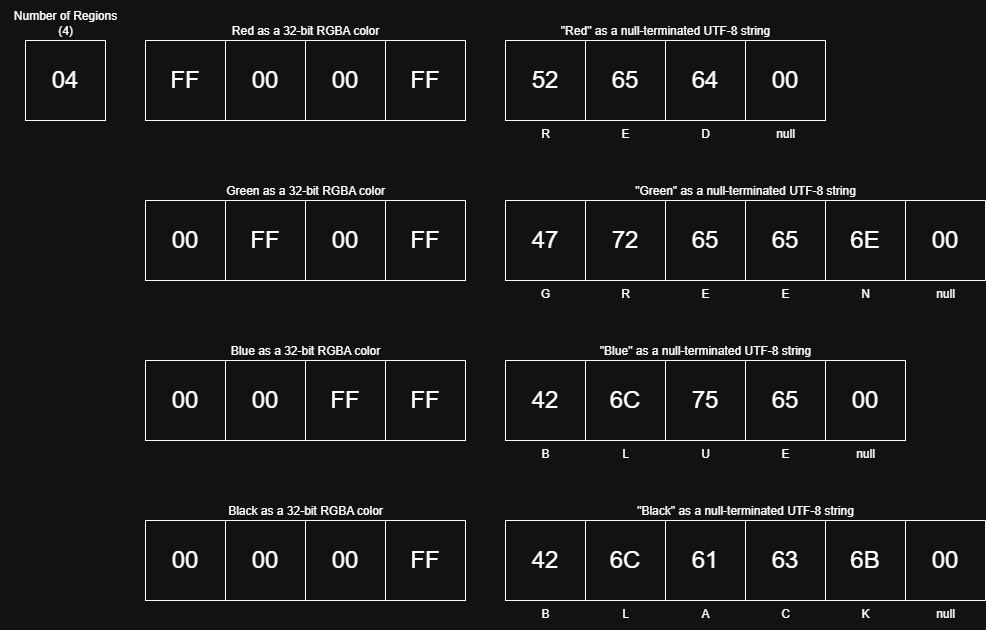

# Boardshapes Serialization Specification

**For Version 0.1.0**

This is the specification for the formats that Boardshapes data can be serialized to and serialized from.

## Binary

The binary format is the most compact format for Boardshapes data. This means it should take the least amount of storage space and the least time to process. However, this also means that the data is unreadable to a human without a special tool.

The data in the binary format is organized into "chunks." Each chunk is prefixed by a single byte identifying which type of chunk it is. The remainder of this specification on the binary format will show the different types of chunks, what they do, and how their data is structured.

The header of each section below is in the format [`chunk_number`] `chunk_name`. The `chunk_number` indicates what the value of the chunk's prefixing byte should be, in order to identify what type that chunk is.

---

### [0] Boardshapes Version

The version of the Boardshapes package used to generate this data.

This chunk should not appear more than once. **It is very inadvisable to not have this chunk,** as it may make the data impossible to deserialize (with the latest package version) in the future.

If this is not the very first chunk in the data, it may make the data impossible to deserialize with backwards-compatible deserializers, meaning you will have to use a deserializer for that specific version of the data.

#### Structure

Should always be in [semver](https://semver.org/) format as a null-terminated UTF-8 string.

Examples:

- 0.5.2
- 1.0.3-beta

---

### [2] Color Table

Lists all possible colors that shapes may be identified by, and their names.

This chunk should not appear more than once.

#### Structure

The value of the first byte of the chunk should be the number of colors in this color table. Following that, each color in the table should be represented by a 32-bit RGBA color followed by the name of the color a null-terminated UTF-8 string.

Example Color Table chunk:

```
0x04FF0000FF5265540000FF00FF477265656E000000FFFF426C756500000000FF426C61636B00
```



---

### [8] Shape Geometry

Represents a shape's position followed by its vertices/path.

#### Structure

The value of the first 4 bytes in the chunk is the shape's unique number as a big-endian 32-bit unsigned integer.

The next 8 bytes are the X and Y positions of the shape's top-left corner in the source image, both of them as unsigned big-endian 16-bit integers.

The next 4 bytes are the number of vertices in the shape as a big-endian 32-bit unsigned integer.

The remaining `(number of vertices) * 4` bytes are the X and Y positions of each vertex in the shape, both of them as unsigned big-endian 16-bit integers.

[Insert Diagram Here?]

---

### [9] Shape Color

Represents a shape's color.

It is recommended to have this color match one in the color table.

#### Structure

The value of the first 4 bytes in the chunk is the shape's unique number as a big-endian 32-bit unsigned integer.

The color is represented by a 32-bit RGBA color.

---

### [10] Shape Image

Represents a shape's appearance as a PNG image.

It is not recommended to use this chunk type while also using "[11] Shape Mask".

#### Structure

The value of the first 4 bytes in the chunk is the shape's unique number as a big-endian 32-bit unsigned integer.

The next 4 bytes are the PNG image's size as a big-endian 32-bit unsigned integer.

The rest of the data in the chunk is the shape's image in PNG format.

---

### [11] Shape Mask

Represents a shape's appearance as a mask.

It is not recommended to use this chunk type while also using "[10] Shape Image".

#### Structure

The value of the first 4 bytes in the chunk is the shape's unique number as a big-endian 32-bit unsigned integer.

The next 2 bytes are the width of the mask as a big-endian 16-bit unsigned integer.

The next byte is a boolean value determining if the mask starts from the top-left filled or empty.

The rest of the data are variable-length integers representing a number of pixels that are either filled or empty, terminated by a null byte.
Please make this make sense later ^^^

---

## JSON

WIP
