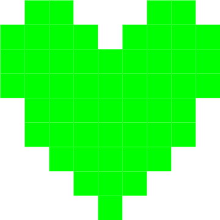
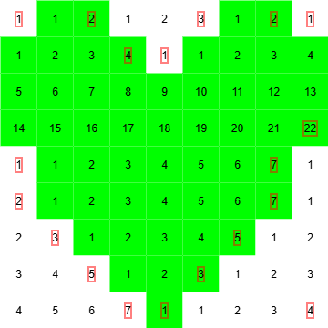

# Boardshapes Serialization Specification

**For Version 0.1.0**

This is the specification for the formats that Boardshapes data can be serialized to and serialized from.

## Binary

The binary format is the most compact format for Boardshapes data. This means it should take the least amount of storage space and the least time to process. However, this also means that the data is unreadable to a human without a special tool.

The data in the binary format is organized into "chunks." Each chunk is prefixed by a single byte identifying which type of chunk it is. The remainder of this specification on the binary format will show the different types of chunks, what they do, and how their data is structured.

The header of each section below is in the format [`chunk_number`] `chunk_name`. The `chunk_number` indicates what the value of the chunk's prefixing byte should be, in order to identify what type that chunk is.

---

### [0] Boardshapes Version

The version of the Boardshapes package used to generate this data.

This chunk should not appear more than once. **It is very inadvisable to not have this chunk,** as it may make the data impossible to deserialize (with the latest package version) in the future.

If this is not the very first chunk in the data, it may make the data impossible to deserialize with backwards-compatible deserializers, meaning you will have to use a deserializer for that specific version of the data.

#### Structure

Should always be in [semver](https://semver.org/) format as a null-terminated UTF-8 string.

Examples:

- 0.5.2
- 1.0.3-beta

---

### [2] Color Table

Lists all possible colors that shapes may be identified by, and their names.

This chunk should not appear more than once.

#### Structure

The value of the first byte of the chunk should be the number of colors in this color table. Following that, each color in the table should be represented by a 32-bit RGBA color followed by the name of the color a null-terminated UTF-8 string.

#### Example

This is a typical color table for Boardshapes data generated with default settings.

```
0x04FF0000FF5265540000FF00FF477265656E000000FFFF426C756500000000FF426C61636B00
```


---

### [8] Shape Geometry

Represents a shape's position followed by its vertices/path.

#### Structure

The value of the first 4 bytes in the chunk is the shape's unique number as a big-endian 32-bit unsigned integer.

The next 8 bytes are the X and Y positions of the shape's top-left corner in the source image, both of them as unsigned big-endian 16-bit integers.

The next 4 bytes are the number of vertices in the shape as a big-endian 32-bit unsigned integer.

The remaining `(number of vertices) * 4` bytes are the X and Y positions of each vertex in the shape, both of them as unsigned big-endian 16-bit integers.

[Insert Diagram Here?]

---

### [9] Shape Color

Represents a shape's color.

It is recommended to have this color match one in the color table.

#### Structure

The value of the first 4 bytes in the chunk is the shape's unique number as a big-endian 32-bit unsigned integer.

The color is represented by a 32-bit RGBA color.

---

### [10] Shape Image

Represents a shape's appearance as a PNG image.

It is not recommended to use this chunk type while also using [[11] Shape Mask](#11-shape-mask).

#### Structure

The value of the first 4 bytes in the chunk is the shape's unique number as a big-endian 32-bit unsigned integer.

The next 4 bytes are the PNG image's size as a big-endian 32-bit unsigned integer.

The rest of the data in the chunk is the shape's image in PNG format.

---

### [11] Shape Mask

Represents a shape's appearance as a mask.

This mask, along with data about the shapes position (see [[10] Shape Geometry](#8-shape-geometry)) can be used to extract the image for the shape from a base image. If no base image is provided, it can fallback to using the shape's color (see [[9] Shape Color](#9-shape-color)).

It is not recommended to use this chunk type while also using [[10] Shape Image](#10-shape-image).

It is recommended to use this chunk type instead of [[10] Shape Image](#10-shape-image) in any scenario where:

1. The base PNG/JPEG image, generally the same image that generated the Boardshapes data, is available during deserialization, so that masks can be used against it.
2. The color palette of the shape images only consists of the shape's designated color (see [[9] Shape Color](#9-shape-color)) and blank pixels.

This is because storing masks instead of PNG images takes up significantly less space.

#### Structure

The value of the first 4 bytes in the chunk is the shape's unique number as a big-endian 32-bit unsigned integer.

The next 2 bytes are the width of the mask as a big-endian 16-bit unsigned integer.

The next byte is a boolean value determining if the mask starts from the top-left filled or empty. This is known as the "starts filled" byte.

The rest of the data representing the mask is a series of unsigned variable-length integers terminated by a null byte. Each unsigned variable-length integer represents a "run-length" of pixels that are either all filled or all empty. You can learn more about unsigned variable-length integers [from this example in the Go documentation.](https://pkg.go.dev/encoding/binary@go1.25.0#example-PutUvarint)

Whether or not the first run-length represents a number of empty pixels or a number of filled pixels depends on the value of the "starts filled" byte. Past the first run-length, it alternates between filled and empty.

#### Example

Suppose we want to represent this image with a mask.



Let's have the shape's number be 7. We can see that the width of the shape is 9 pixels, so that will be the width of the mask. Since the top-left pixel is empty, we want the "starts filled" byte to be 0.

So far, our chunk data looks like this:

```
0x00000007000900
```

Now we'll find our "run-lengths" by finding the lengths of series of filled or empty pixels.



Therefore our run lengths are: 1, 2, 3, 2, 1, 4, 1, 22, 1, 7, 2, 7, 3, 5, 5, 3, 7, 1, 4

Since all of these numbers are under 128, we can represent all of them as single bytes like this: `0x01`, `0x02`, `0x03`, `0x02`, `0x01`, `0x04`, `0x01`, `0x16`, `0x01`, `0x07`, `0x02`, `0x07`, `0x03`, `0x05`, `0x05`, `0x03`, `0x07`, `0x01`, `0x04`.

Therefore our final chunk data looks like this:

```
0x0000000700090001020302010401160107020703050503070104
```

---

## JSON

The JSON format is a straightforward, human-readable representation of Boardshapes data. It is designed for interoperability and ease of inspection, at the cost of larger file size compared to the binary format.

### Structure

A serialized Boardshapes dataset in JSON is an object with the following fields:

- `version` (string): The version of the Boardshapes format (e.g., `"0.1.0"`).
- `shapes` (array): An array of shape objects, each representing a single shape.

Each shape object contains:

- `number` (integer): The unique identifier for the shape.
- `cornerX` (integer): The X coordinate of the shape's top-left corner in the source image.
- `cornerY` (integer): The Y coordinate of the shape's top-left corner in the source image.
- `path` (array of integers): The shape's path as a flat array of vertex coordinates. Each pair of values represents the X and Y coordinates of a vertex (e.g., `[x0, y0, x1, y1, ...]`).
- `color` (object): The shape's color as an object with fields `R`, `G`, `B`, and `A` (all integers, 0–255).
- `colorString` (string): The name of the color, if available (e.g., `"Red"`), or an empty string if not related to a named color.
- `image` (string): The shape's image as a base64-encoded PNG, or an empty string if not present.

### Example

```json
{
  "version": "0.1.0",
  "shapes": [
    {
      "number": 0,
      "cornerX": 12,
      "cornerY": 34,
      "path": [0, 0, 10, 0, 10, 10, 0, 10],
      "color": { "R": 255, "G": 0, "B": 0, "A": 255 },
      "colorString": "Red",
      "image": "iVBORw0KGgoAAAANSUhEUgAA..." // base64 PNG
    }
    // ... more shapes ...
  ]
}
```
